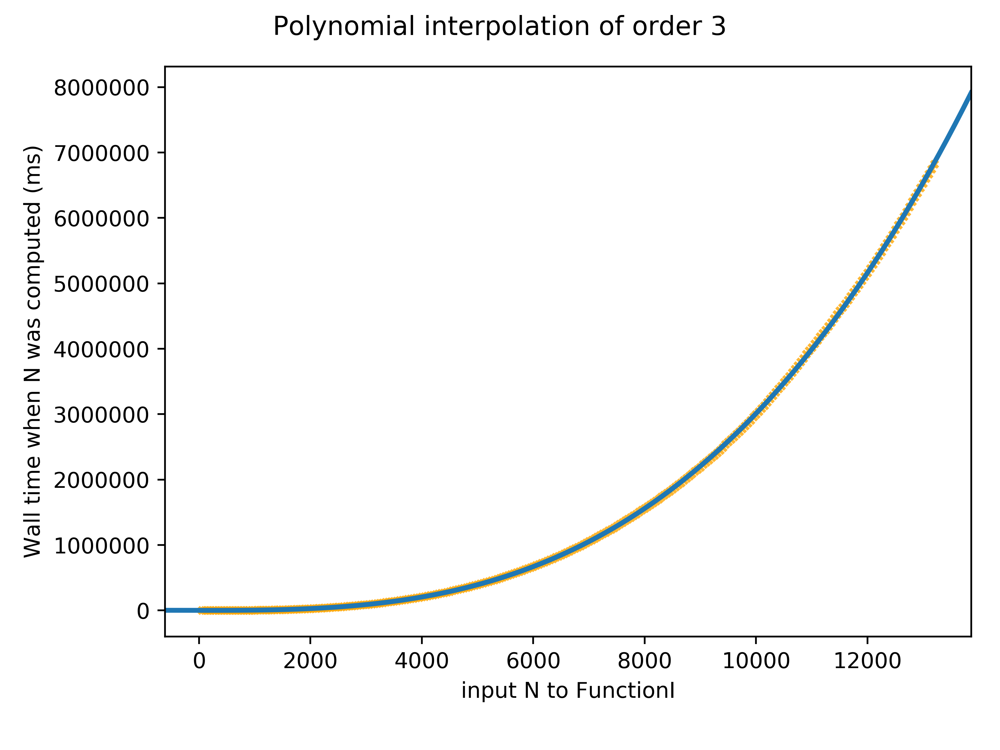
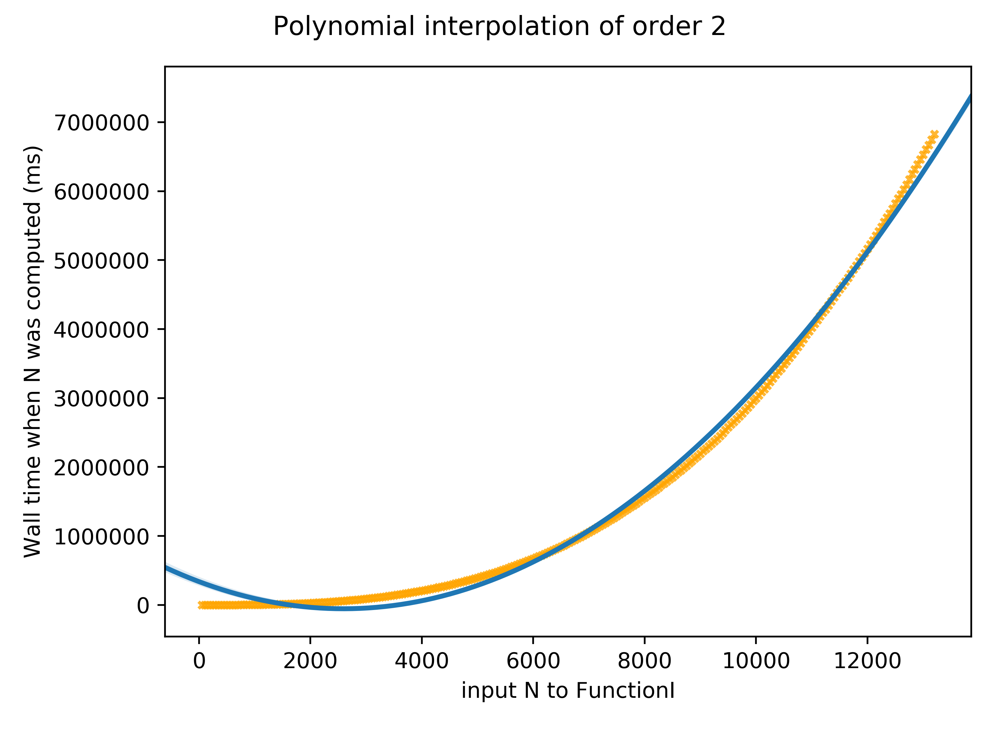

# Problem 451: Modular inverses

## Runtime

* As of 2018-01-27 (commit `aa9369e`) the code runs in `O(n^3)`. That due to the following function call structure:

        FunctionI -> GetNEqualsModInvN -> GetFactors
          O(k)         O(n)                 O(n)
                                       -> GetModularInverse
                                            O(n)
                                       -> GetModularInverse
                                            O(n)
        ===================================================
          O(k)   x     O(n)       x         O(n)
        ===================================================
          O(n^2)

    Since the problem asks one to calculate n calls to `FunctionI` one has an overall complexity of **O(n^3)**. The accompanying file:

    

    

    Supports this hypothesis.

## Improvements

* In the first attempts to solve the problem I used my own reasoning to structure the algorithms. Probably better algorithms exist for this problem.
* To get this problem done in reasonable time at least one of the `GetNEqualsModInvN` or `GetFactors` should have their performance improved, that is, they should be computed in `O(n)` time.

[comment]: # (# vim: set spell spelllang=en_us fileformat=unix filetype=markdown wrap :)
